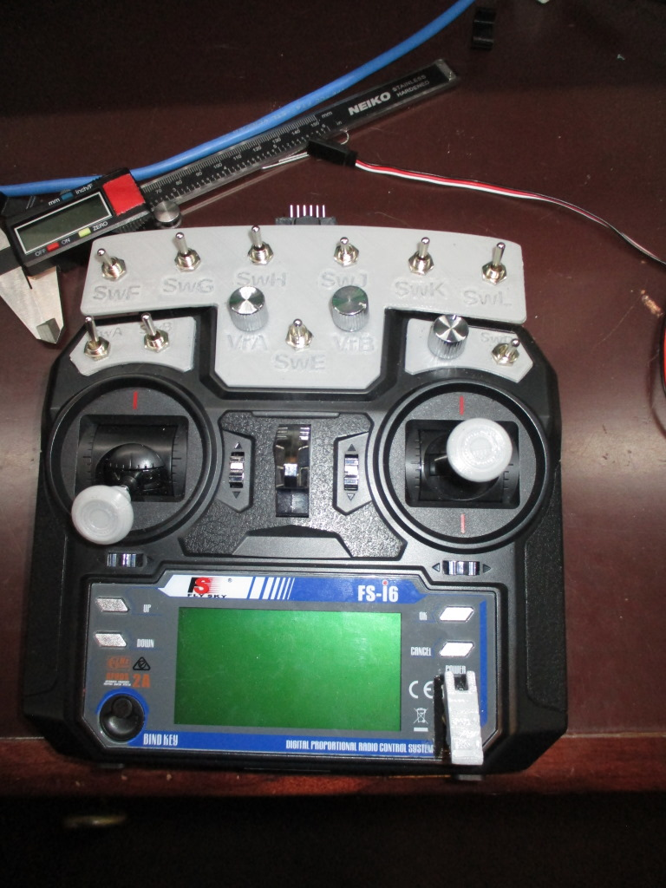
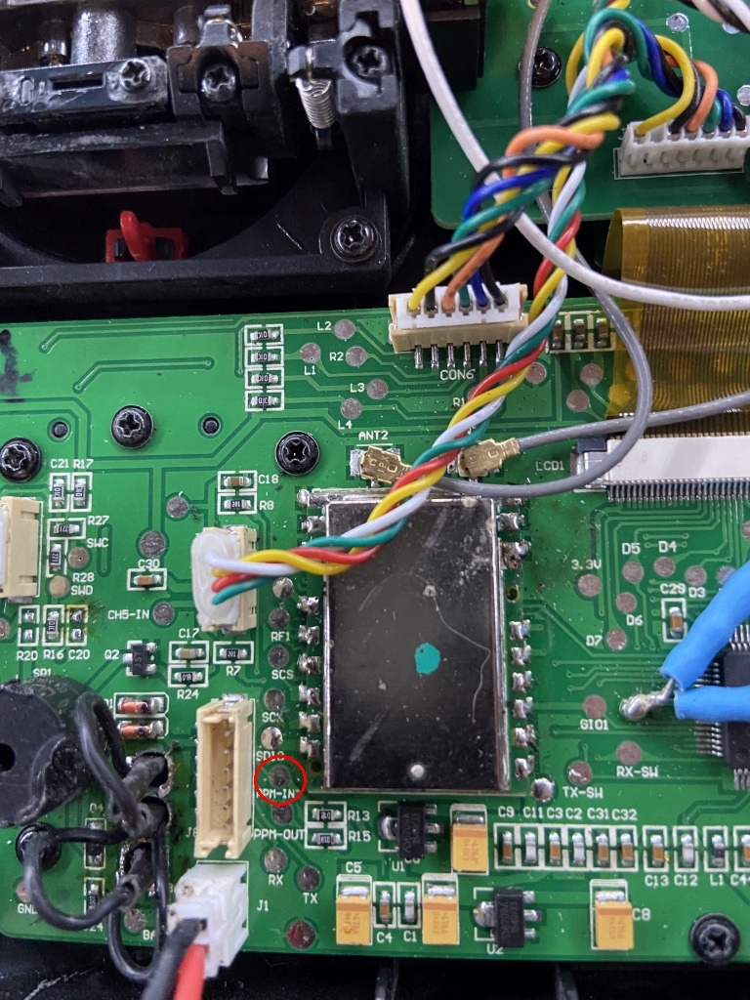
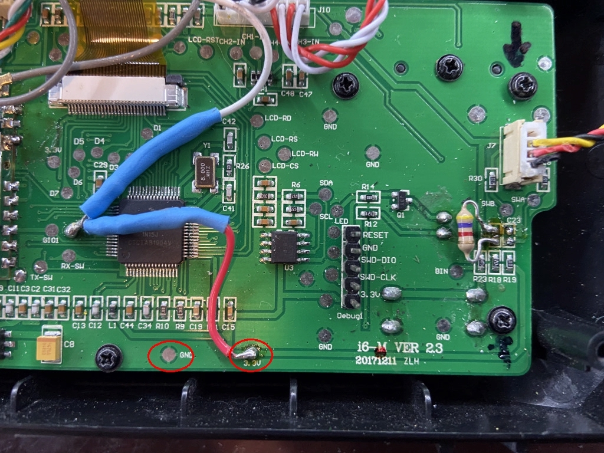
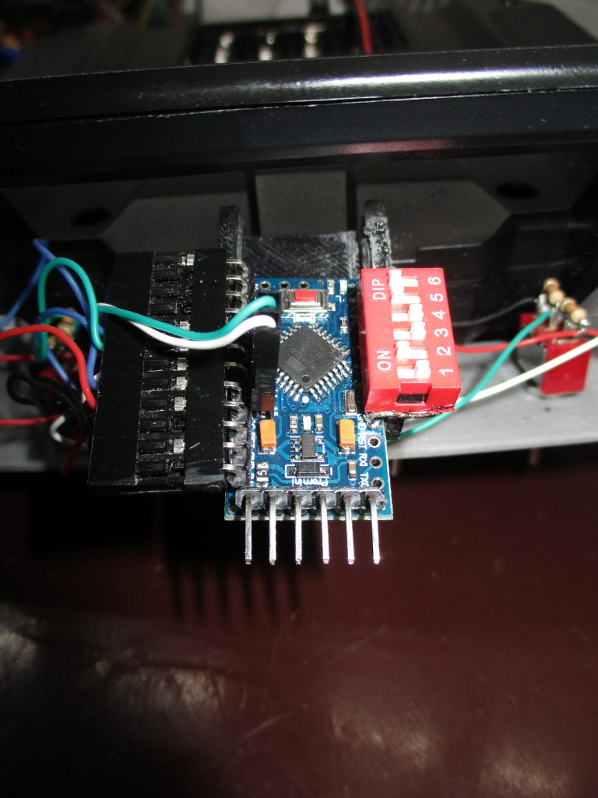
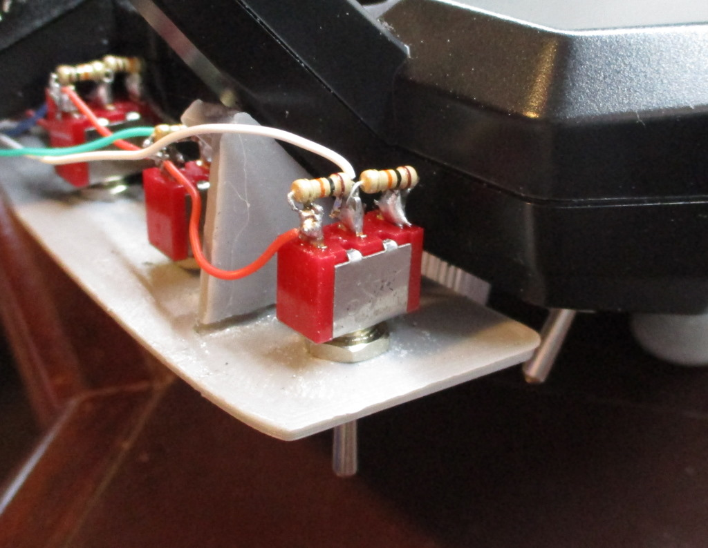
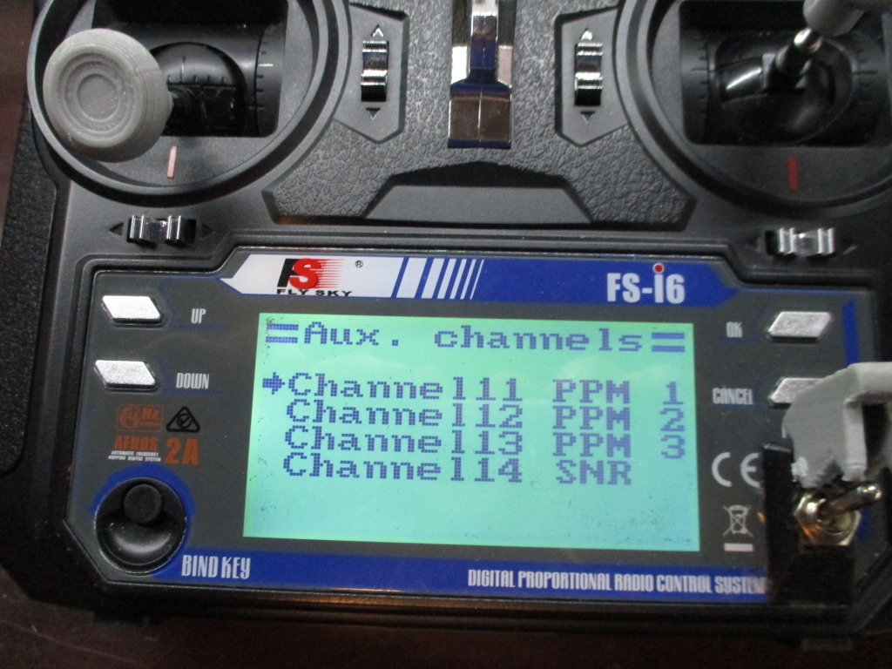

# FlySky-FSi6-more-switches (FlySky FSi6 modifications: More switches and/or pots)

(aka What else floats on water? MORE SWITCHES!)

##Introduction##
You likely know that the FlySky FSi6 TX can be modified, with new firmware from ([https://github.com/qba667/FlySkyI6]https://github.com/qba667/FlySkyI6) to have even more tricks and options than it did from the factory. One such option is to send data from the trainer in port at the back of the unit (the same one used for programming firmware) along to the RX. This data can be accessed just like any of the other 14 channels, directly by the RX or as iBus data by, say, an Arduino. A fellow enthusiast was kind enough to show me some of the clever work he'd done (thank you Gaz!), to use an Arduino on the TX side, to format data to be sent via that trainer port. This data is formatted as "PPM" (pulse position modulation), as opposed to the servo-style "PWM" (pulse width modulation) of 1000-1500-2000 microseconds. The TX has three such channels, which you can select in System Setup -&gt; Aux channels as "PPM1", "PPM2", and "PPM3." This spurred some thinking on my part, and the end result is as follows. As with any project it's a work in progress and I'm always open to suggestions and comments.

#Table of contents:#
- [Overview](#overview)
- [Arduino connections to the TX](#txconnections)
- [Arduino input selections](#inputselections)
- [Arduino input connections](#inputconnections)
- [Returned values](#returnedvalues)
- [Arduino code](#arduinocode)

  
## Overview {#overview}

I did up some code that sits on top of the Arduino code I was given, that allows you to choose from a number of options for switches or potentiometers, reads them and formats them in PPM to be sent along to the RX. You can use from one to three pots or one to six switches, or combinations thereof. That's in addition to the various hardware mods documented on the firmware page above. If you really like switches you can end up with 13 of them plus the two sticks. If you prefer twisty knobs you can end up with six of those plus the sticks. Or you can modify the sticks, whatever, there's tons of permutations. For the "potentiometer" option, anything that can generate a 0-3.3V voltage can be considered a "pot" as it just connects to an analog input on the Arduino. A multi-position rotary switch with a resistor between each leg, as seen on <a href="https://github.com/benb0jangles/FlySky-i6-Mod-/tree/master/6-pos-switch-mod">benb0jangles' page</a>, heck, even a Theremin (no idea why you'd want a remote control device to play spooky music, but hey, you COULD!)

Further, the modded firmware allows you to combine two switches into a single channel, like "SwB+SwC." I used the same idea in this code, with the same values, to allow up to six switches (two in each PPM channel.) Note that since pots use the entire set of analog values you can't combine them; this is why you are limited to three pots, one for each PPM channel.

Here's a modded TX with a pot in place of VrC (via the modded firmware) and SwE, and six additional switches (SwF thru SwL) via this project:

This project uses a 3.3V Arduino Pro Mini, which depending on how modded your TX is, might fit inside the case. I chose to mount it on the underside of the antenna; you can just see the programming header above the switches in the pic above.

<a name="txconnections">
<h2>Arduino connections to the TX</h2>

There's a solder pad for the PPM input ("PPM IN", under "SDIO"). D10 on the Arduino goes to PPM-in.

There are also convenient pads for 3.3V and ground, which go to the Arduino Vcc and ground.

<a name="inputselections">
<h2>Arduino input selections</h2>

Choices of input (switches or pots) are set via digital inputs. I opted to solder a DIP switch directly to the Arduino as it allows easy changes. You could instead use a double-row header with jumpers, or if you're set on your options, solder them and be done.

Each PPM channel's options are selected by one pair of DIP switches (jumpers, digital pins, whatever.) No external pullup is required; if hardwiring, just ground inputs listed as "ON" below, and leave floating those listed as "OFF". Inputs go to the first six analog inputs (A0-5), depending on which options you choose.

<table padding=5 border=1>
<tr>
<th align="left">PPM1 options</th>
<th>DIP switch 1 (D2)</th>
<th>DIP switch 2 (D3)</th>
<th>Arduino pin(s)</th>
</tr>
<tr>
<td>pot</td>
<td>ON</td>
<td>ON</td>
<td>A0 *</td>
</tr>
<tr>
<td>single switch ("SwF")</td>
<td>OFF</td>
<td>ON</td>
<td>A0 *</td>
</tr>
<tr>
<td>two switches ("SwF+G")</td>
<td>OFF</td>
<td>OFF</td>
<td>A0, A1</td>
</tr>
<tr>
<td><i>invalid</i></td>
<td><i>ON</i></td>
<td><i>OFF</i></td>
<td><i>don't use</i></td>
</tr>
</table>

<table padding=5 border=1>
<tr>
<th align="left">PPM2 options</th>
<th>DIP switch 3 (D4)</th>
<th>DIP switch 4 (D5)</th>
<th>Arduino pin(s)</th>
</tr>
<tr>
<td>pot</td>
<td>ON</td>
<td>ON</td>
<td>A2 *</td>
</tr>
<tr>
<td>single switch ("SwH")</td>
<td>OFF</td>
<td>ON</td>
<td>A2 *</td>
</tr>
<tr>
<td>two switches ("SwH+J")</td>
<td>OFF</td>
<td>OFF</td>
<td>A2, A3</td>
</tr>
<tr>
<td><i>invalid</i></td>
<td><i>ON</i></td>
<td><i>OFF</i></td>
<td><i>don't use</i></td>
</tr>
</table>

<table padding=5 border=1>
<tr>
<th align="left">PPM3 options</th>
<th>DIP switch 5 (D6)</th>
<th>DIP switch 6 (D7)</th>
<th>Arduino pin(s)</th>
</tr>
<tr>
<td>pot</td>
<td>ON</td>
<td>ON</td>
<td>A4 *</td>
</tr>
<tr>
<td>single switch ("SwK")</td>
<td>OFF</td>
<td>ON</td>
<td>A4 *</td>
</tr>
<tr>
<td>two switches ("SwK+L")</td>
<td>OFF</td>
<td>OFF</td>
<td>A4, A5</td>
</tr>
<tr>
<td><i>invalid</i></td>
<td><i>ON</i></td>
<td><i>OFF</i></td>
<td><i>don't use</i></td>
</tr>
</table>

<a name="inputconnections">
<h2>Arduino input connections</h2>
For single switch or pot options above (marked *) also connect the next analog input to ground (ie if using A0 for a pot, ground A1.) I find this helps prevent spurious readings by the ADC's.

If using a pot, just connect it to the analog input as a voltage divider:

SPST (on-off) switches require one resistor:

The resistor value isn't critical, as shown.

SPDT (on-off-on) switches require two resistors:

The resistor value isn't critical, as shown, save that they must be equal to act as a 50%-50% voltage divider. The schematic looks kinda funny, but it's actually pretty easy to solder up, especially if you can get 1/8W resistors:

3v3 goes on one end (red wire here), center goes to the analog input (white wire here), and ground to the other end (invisible black wire here.) The connections are the same for any SPDT switch, whether on-off-on, momentary, whatever.

Once you've chosen your input options, go to System Setup -&gt; Aux channels and select which PPM channels to send to the RX, something like this:

<a name="returnedvalues">
<h2>Returned values</h2>

If you choose the pot option, you'll get a response at the RX of 1000...2000, just as you would a dial like VrA on the TX.

If you choose a single switch, you'll either get 1000/2000, for SPST switches, or 1000/1500/2000 for SPDT.

Combining switches is more complicated. I would imagine it's only useful if you're using an Arduino to decode the iBus from the RX, or have some other microcontroller-type device to decode the data. These values are the same as returned by e.g. SwB+C with the modded firmware. The table below lists values returned for combining two switches on A0 and A1 (ie "SwF" and "SwG" into "SwF+G") into PPM1. The same values would be returned in PPM2 when combining two switches on A2 and A3, and in PPM3 when combining A4 and A5. Note that "up" and "down" are relative, but reversing the switch is easy enough (either swap the 3v3 and ground, or just rotate the switch 180&deg;.) Values with an asterisk below only occur for SPDT switches, as SPST switches don't have a center position.

<table padding=5 border=1>
<tr>
<th align="left">SwF</th>
<th align="left">SwG</th>
<th>Value</th>
</tr>
<tr>
<td>Down</td>
<td>Down</td>
<td>1000</td>
</tr>
<tr>
<td>Down</td>
<td>Center</td>
<td>1200 *</td>
</tr>
<tr>
<td>Down</td>
<td>Up</td>
<td>1400</td>
</tr>

<tr>
<td>Center</td>
<td>Down</td>
<td>1300 *</td>
</tr>
<tr>
<td>Center</td>
<td>Center</td>
<td>1500 *</td>
</tr>
<tr>
<td>Center</td>
<td>Up</td>
<td>1700 *</td>
</tr>

<tr>
<td>Up</td>
<td>Down</td>
<td>1600</td>
</tr>
<tr>
<td>Up</td>
<td>Center</td>
<td>1800 *</td>
</tr>
<tr>
<td>Up</td>
<td>Up</td>
<td>2000</td>
</tr>
</table>

<a name="arduinocode">
<h2>Arduino code</h2>
Finally, here's the code in question: <a href="ppm_send.ino">ppm_send.ino</a>. To reiterate, you program this into a 3.3V Pro Mini or clone (not a 5V.) The comments in the code should cover everything you see here, but the pictures may be helpful as well, especially as regarding switch and pot connections. I hope I've covered everything you need, but if not, feel free to let me know via dremu-at-yahoo-dot-com.

</body>
</html>
